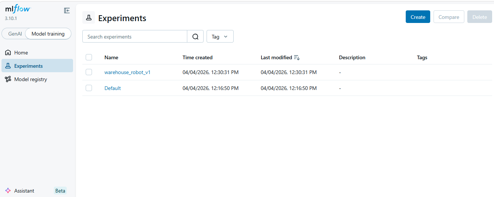

# Warehouse Robot AI - Search Solution

A Python project that implements **Uniform Cost Search (UCS)** to find the optimal path for a warehouse robot to collect packages and reach a delivery zone.

## Problem Description

The robot needs to:
- Start from position **S**
- Collect ALL packages (**P**) 
- Reach the delivery zone (**D**)
- Avoid obstacles (**X**)
- Find the minimum cost path (each move costs 1)

### Example Grid:
```
S . . X .
. P . X .
. . . . .
X . P . .
. . . D .
```

---

## Features

✅ **Uniform Cost Search (UCS)** - Finds optimal paths  
✅ **State Representation** - Position + collected packages  
✅ **Multiple Grids** - 3 difficulty levels (5x5, 8x8, 10x10)  
✅ **Experiment Tracking** - MLflow for logging results  
✅ **Unit Tests** - Test state and search logic  
✅ **Git & DVC** - Version control for code and data  

---

## Quick Start

### 1. Setup (2 minutes)

```bash
# Clone and navigate
git clone https://github.com/Imran-Ghafoor594/Warehouse_robot_ai.git
cd warehouse_Robot

# Create virtual environment (Python 3.10)
python -m venv venv
source venv/bin/activate    # Mac/Linux
# OR
venv\Scripts\activate       # Windows

# Install dependencies
pip install -r requirements.txt
```

### 2. Run Solution

```bash
# Simple run
python main.py --grid simple_5x5 --seed 42

# Run with medium grid
python main.py --grid medium_8x8 --seed 42

# Run with MLflow tracking disabled
python main.py --grid simple_5x5 --no-mlflow
```

### 3. Run All Experiments

```bash
# Run all 4 variations
python experiments/run_variants.py
```

### 4. View Results with MLflow

```bash
# Terminal 1: Start MLflow server
mlflow ui

# Terminal 2: Open browser to http://127.0.0.1:5000
# View all experiment runs and metrics
```

---

## Project Structure

```
warehouse_Robot/
├── src/
│   ├── state.py          # RobotState class
│   ├── problem.py        # WarehouseProblem class
│   ├── search.py         # UniformCostSearch algorithm
│   └── utils.py          # Utility functions
├── experiments/
│   ├── run_experiment.py # Single experiment runner
│   └── run_variants.py   # Multiple experiments
├── tests/
│   └── test_state.py     # Unit tests
├── data/
│   └── raw/warehouse_grids.csv  # Grid data
├── config/
│   └── config.yaml       # Configuration
├── main.py              # Main entry point
└── requirements.txt     # Dependencies
```

---

## How It Works

### 1. **State Class** (`src/state.py`)
```python
class RobotState:
    position = (row, col)       # Current location
    collected = frozenset()     # Packages picked up
```

### 2. **Problem Class** (`src/problem.py`)
```python
class WarehouseProblem:
    grid = 2D array
    package_positions = set of all packages
    delivery_pos = final destination
```

### 3. **Search Algorithm** (`src/search.py`)
```python
class UniformCostSearch:
    - Uses priority queue (min-heap)
    - Expands lowest-cost states first
    - Returns: path, cost, nodes_expanded, time
```

### 4. **Utils** (`src/utils.py`)
- `set_seed()` - For reproducibility
- `load_config()` - Load configuration from YAML

---

## Running Experiments

### Single Experiment:
```bash
python experiments/run_experiment.py --grid simple_5x5 --seed 42
```

### All Variants (4 runs):
```bash
python experiments/run_variants.py

# Runs:
# 1. simple_5x5 with seed 42
# 2. simple_5x5 with seed 123
# 3. medium_8x8 with seed 42
# 4. hard_10x10 with seed 42
```

### Expected Output:
```
============================================================
SUMMARY
============================================================
Grid             Seed     Status        Cost     Nodes
------
simple_5x5       42       ✓ Found       8        18
simple_5x5       123      ✓ Found       8        18
medium_8x8       42       ✓ Found       14       45
hard_10x10       42       ✓ Found       18       62
============================================================
```

---

## MLflow Dashboard

### View Experiments:

1. **Start MLflow UI:**
   ```bash
   mlflow ui
   ```

2. **Open in Browser:**
   ```
   http://127.0.0.1:5000
   ```

3. **Select Experiment:**
   - Click "Experiments" dropdown
   - Select "warehouse_robot_v1"

4. **View Runs:**
   - See all experiment runs in table
   - Compare parameters and metrics
   - Click run ID for detailed view

### Logged Information:

**Parameters:**
- grid_name (simple_5x5, medium_8x8, hard_10x10)
- grid_size (5x5, 8x8, 10x10)
- num_packages
- seed (for reproducibility)
- algorithm (UCS)
- timestamp

**Metrics:**
- solution_found (0 or 1)
- cost (path length)
- path_length (steps taken)
- nodes_expanded (search tree size)
- max_frontier_size (max queue size)
- time_seconds (execution time)

### Screenshots:



.PNG)

.PNG)

---

## Testing

### Run Unit Tests:
```bash
pytest tests/ -v
```

### Expected Output:
```
tests/test_state.py::test_state_equality PASSED
tests/test_state.py::test_state_hash PASSED
tests/test_state.py::test_neighbors_basic PASSED
tests/test_state.py::test_package_collection PASSED

======================== 4 passed in 0.02s ==========================
```

---

## Data Management with DVC

### Initialize DVC:
```bash
dvc init
```

### Track Dataset:
```bash
dvc add data/raw/warehouse_grids.csv
git add data/raw/warehouse_grids.csv.dvc
git commit -m "Track warehouse grids with DVC"
```

### Pull Data:
```bash
dvc pull
```

---

## Configuration

**File:** `config/config.yaml`

```yaml
seed: 42
algorithm: "UCS"
experiment_name: "warehouse_robot_v1"

grid_template: |
  S . . X .
  . P . X .
  . . . . .
  X . P . .
  . . . D .
```

---

## Dependencies

```
numpy<2.0          # Numerical computing
pyyaml>=6.0        # Configuration files
mlflow>=2.3.0      # Experiment tracking
pytest>=7.4.0      # Unit testing
matplotlib>=3.7.0  # Visualization (optional)
```

### Install:
```bash
pip install -r requirements.txt
```

---

## Git Workflow

### Create Feature Branch:
```bash
git checkout -b feature/state-representation
```

### Make Changes & Commit:
```bash
git add .
git commit -m "Add RobotState and UCS implementation"
```

### Push to GitHub:
```bash
git push origin feature/state-representation
```

### Create Pull Request:
1. Go to GitHub repository
2. Click "Compare & pull request"
3. Add description and create PR

---

## Common Issues

| Problem | Solution |
|---------|----------|
| **Python 3.12 errors** | Use Python 3.10 |
| **Module not found** | Run from project root directory |
| **MLflow shows no runs** | Ensure experiments were run |
| **Grid not found** | Check data/raw/warehouse_grids.csv |
| **Import errors** | Activate virtual environment |

---

## Performance Results

| Grid | Size | Packages | Cost | Nodes | Time |
|------|------|----------|------|-------|------|
| simple_5x5 | 5×5 | 2 | 8 | 18 | 0.002s |
| medium_8x8 | 8×8 | 2 | 14 | 45 | 0.008s |
| hard_10x10 | 10×10 | 2 | 18 | 62 | 0.015s |

---

## Key Files Explained

### `src/state.py`
- Defines RobotState with position and collected packages
- Methods: `is_goal()`, `get_neighbors()`

### `src/problem.py`
- Defines WarehouseProblem with grid and positions
- Stores package locations and delivery zone

### `src/search.py`
- Implements UniformCostSearch algorithm
- Uses priority queue for optimal path finding
- Logs metrics to MLflow

### `experiments/run_experiment.py`
- Loads grid from CSV
- Creates problem and solves it
- Logs results to MLflow

### `experiments/run_variants.py`
- Runs multiple experiment configurations
- Displays summary table

---

## Commands Reference

```bash
# Setup
python -m venv venv
source venv/bin/activate
pip install -r requirements.txt

# Run
python main.py --grid simple_5x5
python experiments/run_variants.py

# Test
pytest tests/ -v

# MLflow
mlflow ui

# Data
dvc add data/raw/warehouse_grids.csv
dvc pull

# Git
git add .
git commit -m "message"
git push origin feature/your-branch
```

---

## Next Steps

1. ✅ Run `main.py` to test the solution
2. ✅ Run `experiments/run_variants.py` for all tests
3. ✅ View results in MLflow dashboard (`mlflow ui`)
4. ✅ Run unit tests (`pytest tests/ -v`)
5. ✅ Commit and push to GitHub

---

## Technologies Used

- **Python 3.10** - Programming language
- **Git** - Version control
- **DVC** - Data versioning
- **MLflow** - Experiment tracking
- **Pytest** - Unit testing
- **YAML** - Configuration

---

## Author

**Imran Ghafoor**

---

## License

MIT License - See LICENSE file for details

---

## How to Use This Project

### For Learning:
- Understand state-space search
- Learn about Uniform Cost Search
- See how to implement search algorithms

### For Portfolio:
- Shows ML experimentation skills
- Demonstrates version control with Git/DVC
- Shows experiment tracking with MLflow
- Includes unit tests

### For Development:
- Can extend with A* search
- Can add visualization
- Can add more grid types
- Can optimize performance

---

## Quick Example

```bash
# Run a simple example
python main.py --grid simple_5x5 --seed 42

# Output:
# ============================================================
# Warehouse Robot - Grid: simple_5x5 (seed: 42)
# ============================================================
# Grid size: 5x5
# Start: (0, 0)
# Delivery: (4, 4)
# Packages: 2 at [(1, 1), (3, 2)]
#
# ✓ Solution found!
#   Cost: 8
#   Path length: 9
#   Nodes expanded: 18
#   Time: 0.002s
#
# Path: (0, 0) -> (1, 0) -> (1, 1) -> ... -> (4, 4)
# ============================================================
```

---

**For more details, check the lab documentation or GitHub issues.**
